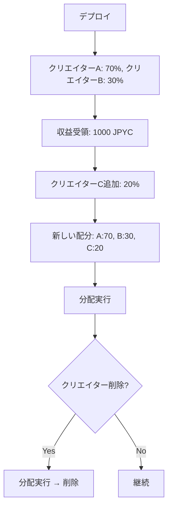

# GifterraPaySplitter v2 設計書

## 概要

GifterraPaySplitter v2 は、**可変分配機能**を持つ支払い受け口・分配・イベント発火コントラクトです。

### v1からの主な変更点

| 機能 | v1（不変） | v2（可変） |
|------|-----------|-----------|
| **クリエイター管理** | ❌ デプロイ時に固定 | ✅ UI上で追加・削除可能 |
| **配分比率変更** | ❌ 変更不可 | ✅ UI上で変更可能 |
| **実装基盤** | OpenZeppelin PaymentSplitter継承 | 完全独自実装 |
| **柔軟性** | ❌ 低い（再デプロイ必要） | ✅ 高い（動的変更） |
| **安全性** | ✅ 非常に高い | ✅ 高い（Owner権限管理） |

---

## 新機能

### 1. クリエイターの動的追加

```solidity
function addPayee(address account, uint256 shares_) external onlyOwner
```

**機能:**
- 新しいクリエイターを追加
- 配分比率を設定

**使用例:**
```solidity
// クリエイターBを追加（シェア30%）
paySplitter.addPayee(0xクリエイターB, 30);
```

**UI実装例:**
```typescript
// Admin画面で「クリエイター追加」ボタン
<button onClick={async () => {
  await contract.call("addPayee", [newAddress, newShares]);
  alert("✅ クリエイターを追加しました！");
}}>
  + クリエイター追加
</button>
```

---

### 2. クリエイターの削除

```solidity
function removePayee(address account) external onlyOwner
```

**機能:**
- クリエイターを削除
- 削除前に分配可能額がある場合はエラー（安全機能）

**重要な注意:**
- 削除前に必ず `release()` で分配を実行してください
- 分配済み収益には影響しません

**使用例:**
```solidity
// 1. まず分配実行
paySplitter.release(payable(0xクリエイターC));

// 2. クリエイター削除
paySplitter.removePayee(0xクリエイターC);
```

---

### 3. 配分比率の変更

```solidity
function updateShares(address account, uint256 newShares) external onlyOwner
```

**機能:**
- 既存クリエイターのシェアを変更
- 変更前の収益には影響しない

**使用例:**
```solidity
// クリエイターAのシェアを50% → 60%に変更
paySplitter.updateShares(0xクリエイターA, 60);
```

---

## アーキテクチャ

### 状態管理

```solidity
// クリエイター配列
address[] private _payees;

// シェア（配分比率）
mapping(address => uint256) private _shares;

// インデックス管理（削除の効率化）
mapping(address => uint256) private _payeeIndex;

// 累計受領額
uint256 private _totalNativeReceived;
mapping(IERC20 => uint256) private _totalERC20Received;

// 分配済み額
mapping(address => uint256) private _nativeReleased;
mapping(IERC20 => mapping(address => uint256)) private _erc20Released;
```

### 分配ロジック

v2では完全独自実装により、以下の計算式で分配額を決定：

```
分配可能額 = (累計受領額 × 自分のシェア / 総シェア) - 既に分配済みの額
```

**例:**
- 累計受領額: 1000 JPYC
- クリエイターA: シェア 50（50%）
- クリエイターB: シェア 30（30%）
- クリエイターC: シェア 20（20%）
- 総シェア: 100

クリエイターAの分配可能額:
```
(1000 × 50 / 100) - 既に分配済みの額 = 500 - 既に分配済みの額
```

---

## セキュリティ設計

### 1. Owner権限による管理

- クリエイターの追加・削除・変更は `onlyOwner` で保護
- 悪意ある変更を防止

### 2. 既存収益の保護

- 変更前の収益は適切に計算・保護
- シェア変更しても過去の分配済み額には影響しない

### 3. 削除時の安全機能

```solidity
require(pendingNative == 0, "Payee has pending native payment. Release before removing.");
```

- 分配可能額が残っている場合は削除不可
- 先に分配を実行する必要がある

### 4. リエントランシー対策

- すべての状態変更関数に `nonReentrant` を適用
- 外部呼び出し前に状態を更新

---

## 使用例

### デプロイ

```solidity
address[] memory initialPayees = new address[](2);
initialPayees[0] = 0xクリエイターA;
initialPayees[1] = 0xクリエイターB;

uint256[] memory initialShares = new uint256[](2);
initialShares[0] = 70; // 70%
initialShares[1] = 30; // 30%

GifterraPaySplitterV2 splitter = new GifterraPaySplitterV2(
    initialPayees,
    initialShares
);
```

### クリエイター管理フロー



### UI統合例

```typescript
// クリエイター情報取得
const [payees, shares] = await contract.call("getAllPayees");

// 表示
payees.forEach((address, i) => {
  console.log(`${address}: ${shares[i]}%`);
});

// クリエイター追加
await contract.call("addPayee", [newAddress, 25]);

// シェア変更
await contract.call("updateShares", [address, 35]);

// 分配実行
await contract.call("releaseAllERC20", [jpycTokenAddress]);
```

---

## View関数（統計・管理）

### getAllPayees()

```solidity
function getAllPayees() external view returns (
    address[] memory payees,
    uint256[] memory shares
)
```

**用途:** 全クリエイターのリストとシェアを一括取得

### pendingNativePayment()

```solidity
function pendingNativePayment(address account) external view returns (uint256)
```

**用途:** 指定クリエイターの分配可能額を確認

### getStats()

```solidity
function getStats() external view returns (
    uint256 payeeCount_,
    uint256 totalShares_,
    uint256 nativeBalance,
    uint256 totalNativeReceived_,
    bool isPaused
)
```

**用途:** コントラクト全体の統計情報を取得

---

## イベント

### 新規イベント（v2）

```solidity
// クリエイター追加
event PayeeAdded(address indexed account, uint256 shares);

// クリエイター削除
event PayeeRemoved(address indexed account);

// シェア変更
event SharesUpdated(address indexed account, uint256 oldShares, uint256 newShares);

// 分配実行（ネイティブ通貨）
event NativeReleased(address indexed account, uint256 amount);

// 分配実行（ERC20）
event ERC20Released(IERC20 indexed token, address indexed account, uint256 amount);
```

### v1互換イベント

```solidity
// 寄付受領（v1と同じ）
event DonationReceived(
    address indexed payer,
    address indexed token,
    uint256 amount,
    bytes32 indexed sku,
    bytes32 traceId
);
```

---

## マイグレーション（v1 → v2）

### 既存のv1ユーザー向け

1. **v2をデプロイ**
   - 現在のクリエイター構成で初期化

2. **GIFT HUBのアドレス更新**
   - Admin画面でPaymentSplitterアドレスをv2に変更

3. **v1の残高を分配**
   - v1コントラクトで `releaseAll()` を実行
   - すべての収益を分配

4. **v2で運用開始**
   - 新しい収益はv2に蓄積
   - 必要に応じてクリエイター追加・変更

---

## ベストプラクティス

### クリエイター削除時

```solidity
// ❌ 悪い例（分配せずに削除）
paySplitter.removePayee(address); // → エラー

// ✅ 良い例（分配してから削除）
paySplitter.release(payable(address));
paySplitter.removePayee(address);
```

### シェア変更のタイミング

- 分配前にシェアを変更すると、変更後の比率が適用される
- 定期的に分配してからシェアを変更するのが推奨

### UI設計

```typescript
// クリエイター管理画面
<div>
  <h3>クリエイター一覧</h3>
  {payees.map((address, i) => (
    <div key={address}>
      <span>{address}</span>
      <input
        type="number"
        value={shares[i]}
        onChange={(e) => updateShare(address, e.target.value)}
      />
      <button onClick={() => removeCreator(address)}>削除</button>
    </div>
  ))}
  <button onClick={addCreator}>+ クリエイター追加</button>
</div>
```

---

## 制限事項

### v2の制限

1. **Owner権限が必要**
   - クリエイター管理はOwnerのみ
   - マルチシグ推奨（本番環境）

2. **削除時は分配が必要**
   - 分配可能額がある場合は削除不可
   - 手動で分配してから削除

3. **ガスコスト**
   - クリエイター数が増えると `releaseAll()` のガスコストが増加
   - 推奨最大数: 20-30人

---

## 監査・テスト

### テストケース

1. ✅ クリエイター追加・削除
2. ✅ シェア変更
3. ✅ 分配計算の正確性
4. ✅ リエントランシー攻撃対策
5. ✅ Owner権限チェック
6. ✅ エッジケース（ゼロシェア、ゼロクリエイター等）

### 監査推奨事項

- セキュリティ監査を受けることを推奨
- 本番環境ではマルチシグウォレットをOwnerに設定

---

## バージョン情報

```
GifterraPaySplitterV2 v2.0.0
- Variable Payment Splitter with Dynamic Creator Management
- Full custom implementation (no OpenZeppelin PaymentSplitter dependency)
```

---

## 関連ドキュメント

- [v1設計書](./PAYSPLITTER-DESIGN.md)
- [OpenZeppelin Ownable](https://docs.openzeppelin.com/contracts/4.x/api/access#Ownable)
- [Remix デプロイガイド](../docs/remix-deployment-guide.md)

---

## ライセンス

MIT License
